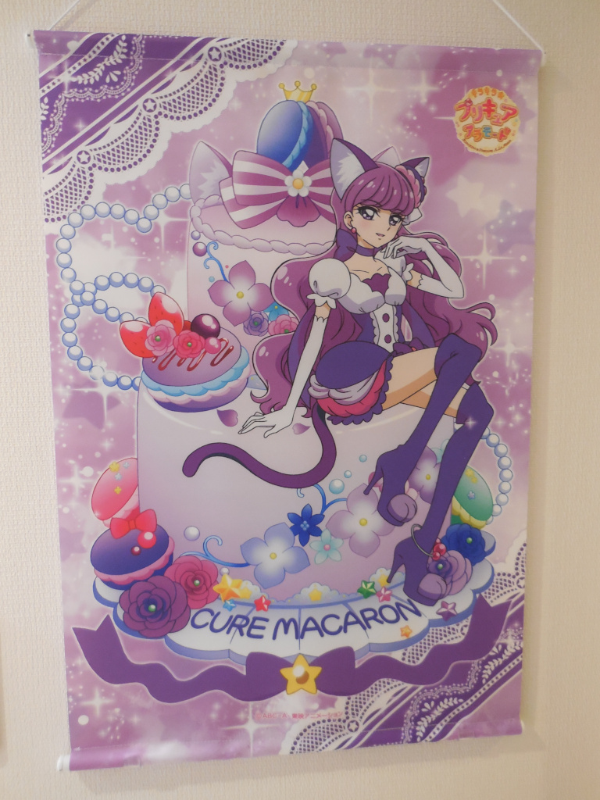
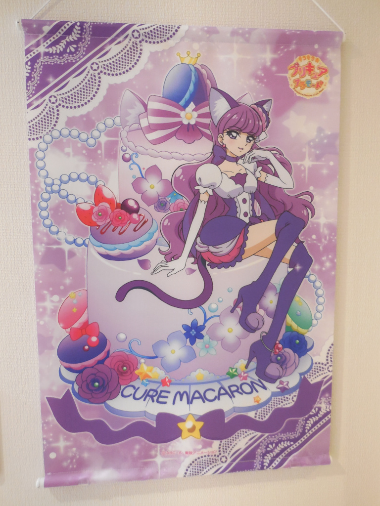
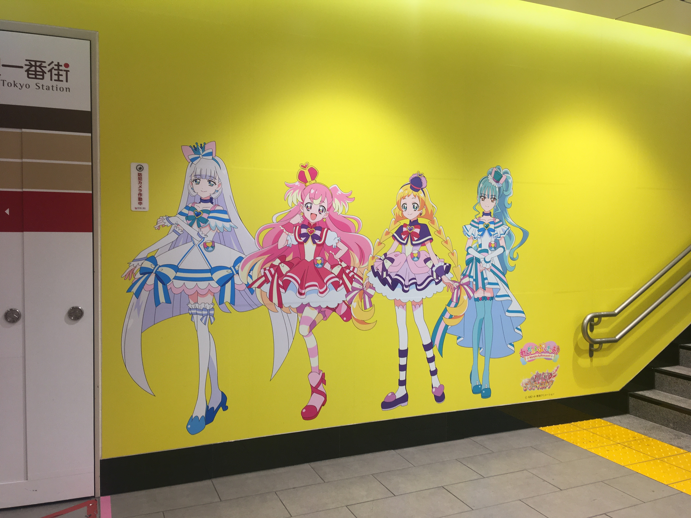
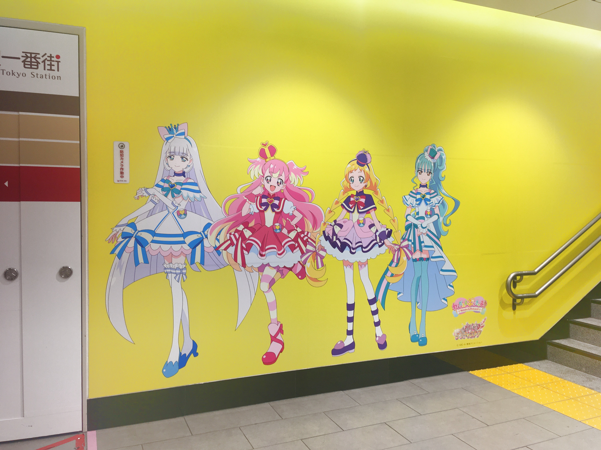
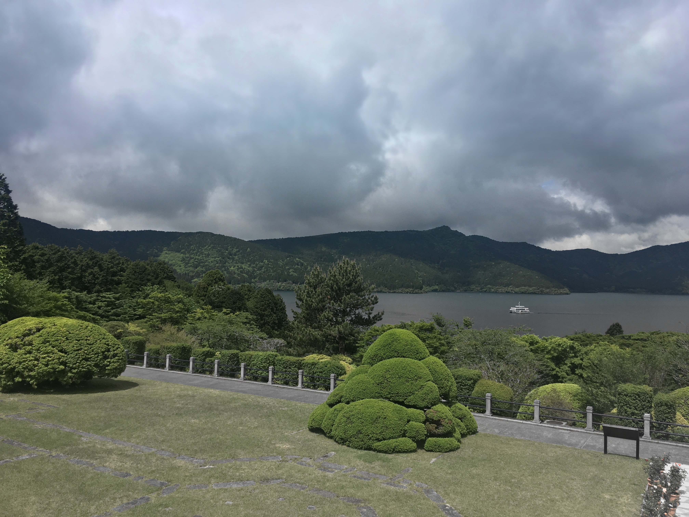

# Eqlm

A CLI tool to manipulate images in various ways

## Installation

```sh
pip install eqlm
```

### With Clipboard Support

```sh
pip install eqlm[clipboard]
```

## Examples

### `$ eqlm eq images/macaron.jpg -n 3 2 -t 0.8 -c`

| Source                             | Result                                   |
| ---------------------------------- | ---------------------------------------- |
|  |  |

### `$ eqlm eq images/mayuno.jpg -n 16 2 -t 0.7 -c -i makima`

| Source                            | Result                                  |
| --------------------------------- | --------------------------------------- |
|  |  |

### `$ eqlm eq images/yaesu-wall.jpg -m lightness -t 0.9 -n 9 6`

| Source                                | Result                                      |
| ------------------------------------- | ------------------------------------------- |
|  |  |

### `$ eqlm eq images/hakone.jpg -m saturation -t 0.2 --clamp`

| Source                            | Result                                  |
| --------------------------------- | --------------------------------------- |
|  |  |

## Commands

The main program can be invoked either through the `eqlm` command or through the Python main module option `python3 -m eqlm`.
Each operation is implemented as a subcommand shown below.

### Eq

Spatially equalize image lightness, saturation, or brightness

```txt
usage: eqlm eq [-h] [-m {l,brightness,saturation,lightness}] [-n M N]
               [-i {linear,cubic,akima,makima}] [-t RATE] [-c] [-e] [-u]
               [-g [GAMMA]] [-d {8,16}] [-s] [-x]
               IN_FILE [OUT_FILE]

equalize image lightness

positional arguments:
  IN_FILE               input image file path (use '-' for stdin, '_' for
                        clipboard)
  OUT_FILE              output PNG image file path (use '-' for stdout, '_'
                        for clipboard) (default: AutoUnique)

options:
  -h, --help            show this help message and exit
  -m {l,brightness,saturation,lightness}, --mode {l,brightness,saturation,lightness}
                        processing mode (l: L (LAB), brightness: Brightness
                        (HSV), saturation: Saturation (HSV), lightness:
                        Lightness (HLS)) (default: l)
  -n M N, --divide M N  divide image into MxN (Horizontal x Vertical) blocks
                        for aggregation (default: (2, 2))
  -i {linear,cubic,akima,makima}, --interpolation {linear,cubic,akima,makima}
                        interpolation method (linear: Linear, cubic:
                        CubicSpline, akima: AkimaSpline, makima:
                        ModifiedAkimaSpline) (default: linear)
  -t RATE, --target RATE
                        set the target rate for the output level, ranging from
                        0.0 (minimum) to 1.0 (maximum) (default: Average)
  -c, --clamp           clamp the level values in extrapolated boundaries
                        (default: False)
  -e, --median          aggregate each block using median instead of mean
                        (default: False)
  -u, --unweighted      disable weighting based on the alpha channel (default:
                        False)
  -g [GAMMA], --gamma [GAMMA]
                        apply inverse gamma correction before process
                        [GAMMA=2.2] (default: None)
  -d {8,16}, --depth {8,16}
                        bit depth of the output PNG image (default: 8)
  -s, --slow            use the highest PNG compression level (default: False)
  -x, --no-orientation  ignore the Exif orientation metadata (default: False)
```

### Match

Match histogram of source image to reference image

```txt
usage: eqlm match [-h]
                  [-m {rgb,red,green,blue,lab,ab,l,brightness,saturation,lightness}]
                  [-a SOURCE REFERENCE] [-u] [-g [GAMMA]] [-d {8,16}] [-s]
                  [-x]
                  SOURCE_FILE REFERENCE_FILE [OUT_FILE]

match histogram of source image to reference image

positional arguments:
  SOURCE_FILE           source image file path (use '-' for stdin, '_' for
                        clipboard)
  REFERENCE_FILE        reference image file path (use '-' for stdin, '_' for
                        clipboard)
  OUT_FILE              output PNG image file path (use '-' for stdout, '_'
                        for clipboard) (default: AutoUnique)

options:
  -h, --help            show this help message and exit
  -m {rgb,red,green,blue,lab,ab,l,brightness,saturation,lightness}, --mode {rgb,red,green,blue,lab,ab,l,brightness,saturation,lightness}
                        processing mode (rgb: RGB, red: Red (RGB), green:
                        Green (RGB), blue: Blue (RGB), lab: LAB, ab: AB (LAB),
                        l: L (LAB), brightness: Brightness (HSV), saturation:
                        Saturation (HSV), lightness: Lightness (HLS))
                        (default: rgb)
  -a SOURCE REFERENCE, --alpha SOURCE REFERENCE
                        cutout threshold for the alpha channel (source,
                        reference) (default: (0.0, 0.5))
  -u, --unweighted      disable cutout based on the alpha channel (default:
                        False)
  -g [GAMMA], --gamma [GAMMA]
                        apply inverse gamma correction before process
                        [GAMMA=2.2] (default: None)
  -d {8,16}, --depth {8,16}
                        bit depth of the output PNG image (default: 8)
  -s, --slow            use the highest PNG compression level (default: False)
  -x, --no-orientation  ignore the Exif orientation metadata (default: False)
```

## License

GNU Affero General Public License v3.0 or later

Copyright (C) 2025 curegit

This program is free software: you can redistribute it and/or modify it under the terms of the GNU Affero General Public License as published by the Free Software Foundation, either version 3 of the License, or (at your option) any later version.

This program is distributed in the hope that it will be useful, but WITHOUT ANY WARRANTY; without even the implied warranty of MERCHANTABILITY or FITNESS FOR A PARTICULAR PURPOSE.
See the GNU Affero General Public License for more details.

You should have received a copy of the GNU Affero General Public License along with this program.
If not, see <https://www.gnu.org/licenses/>.
